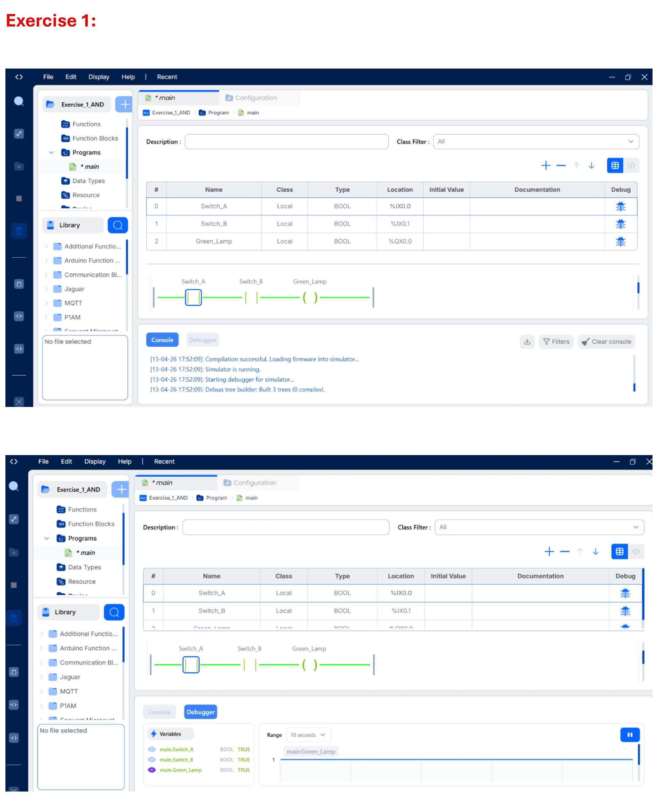
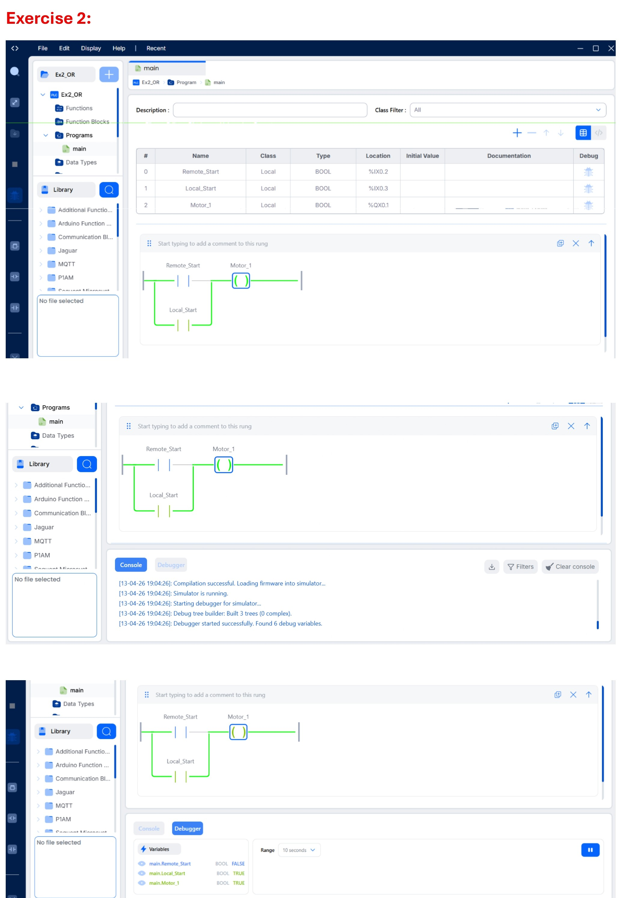
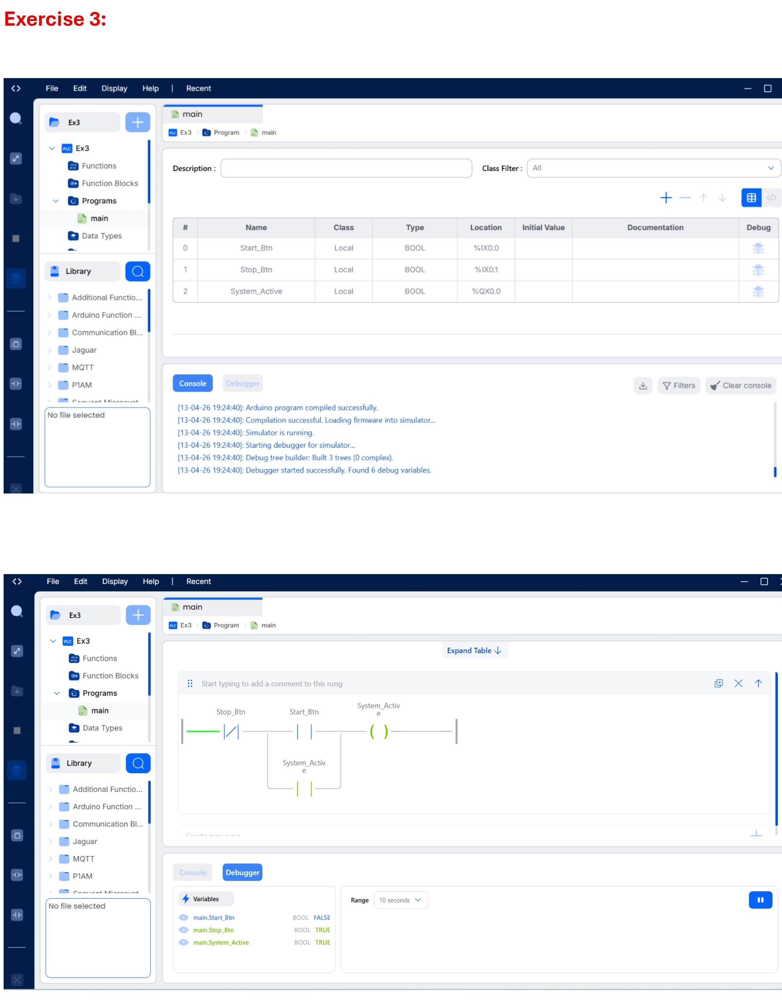
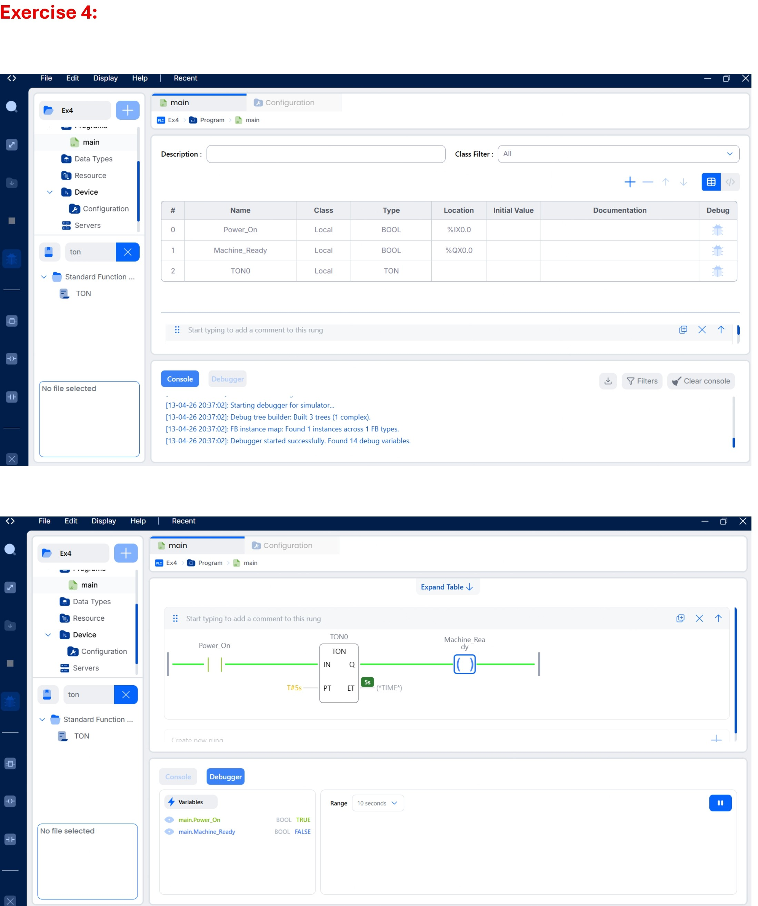
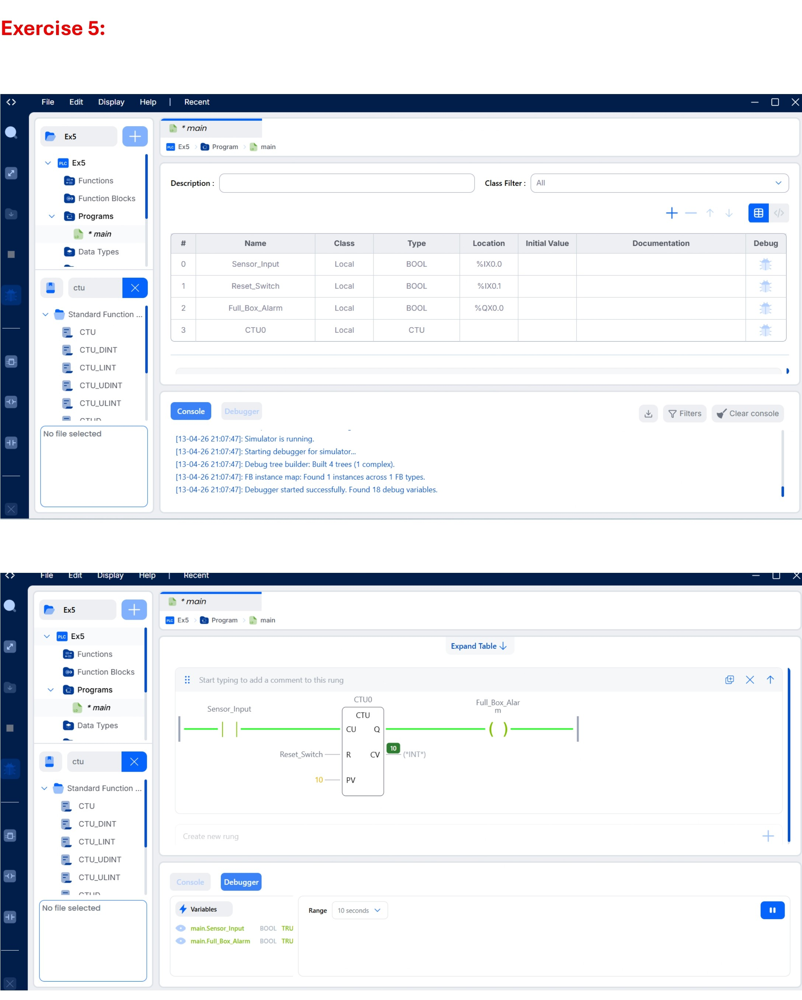
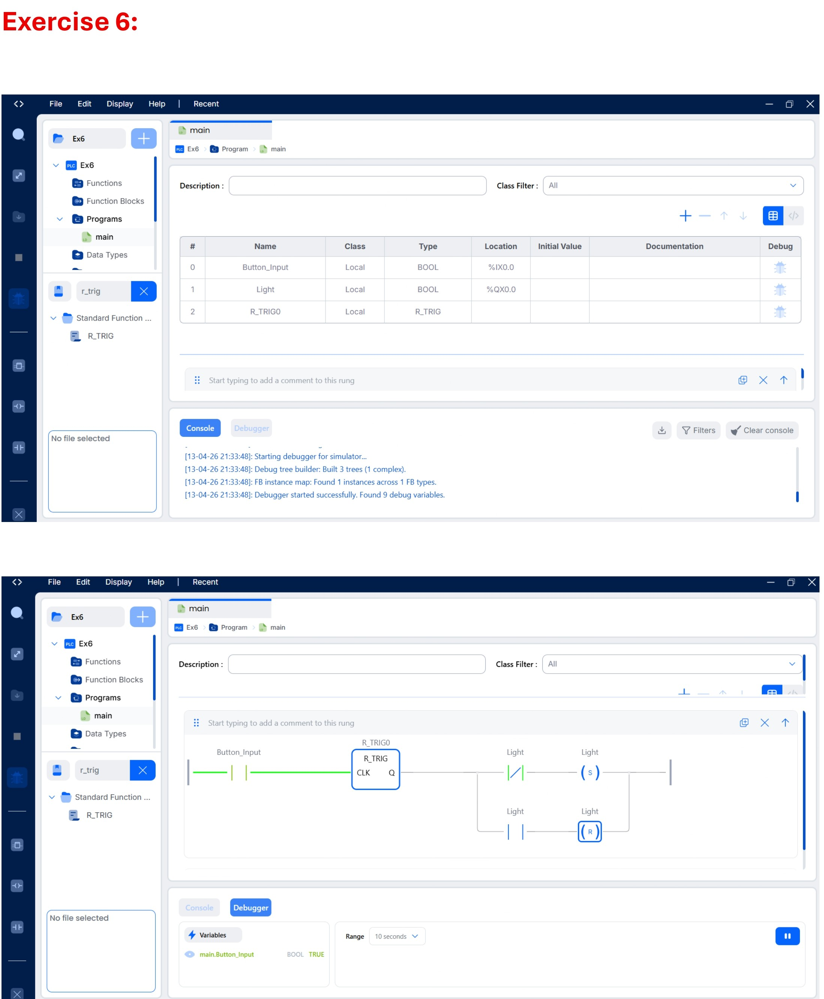
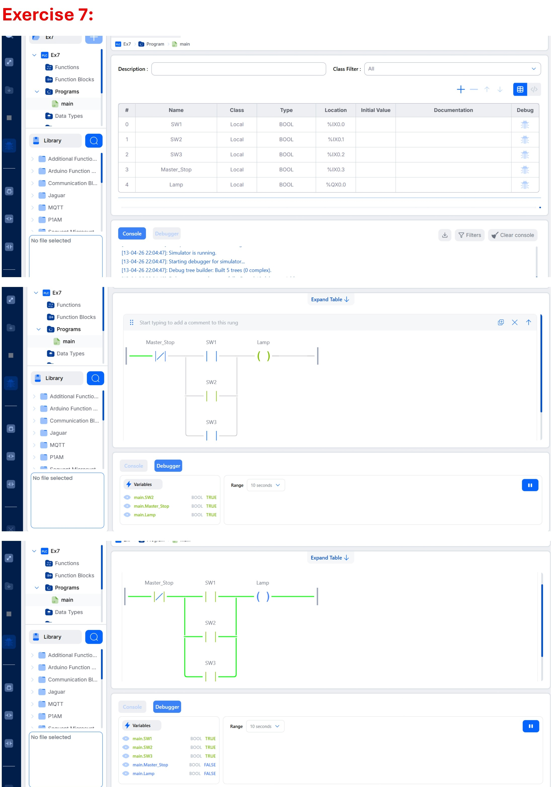
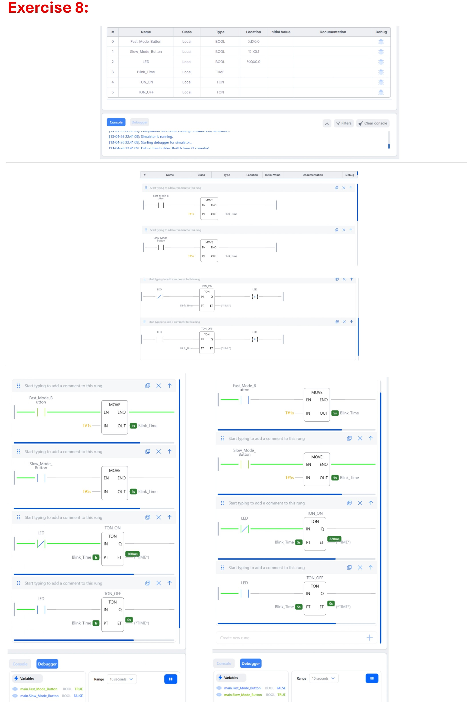
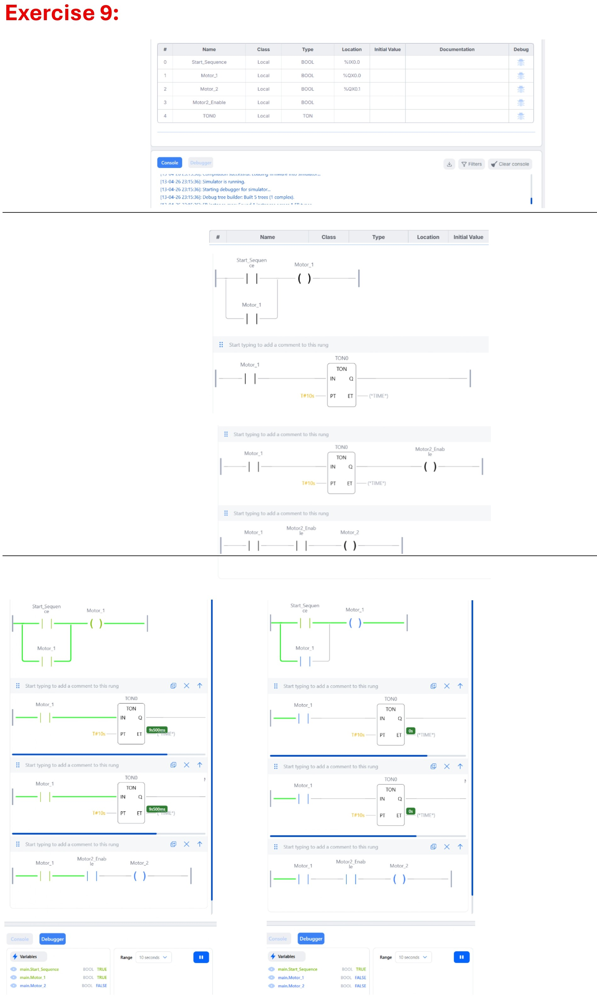
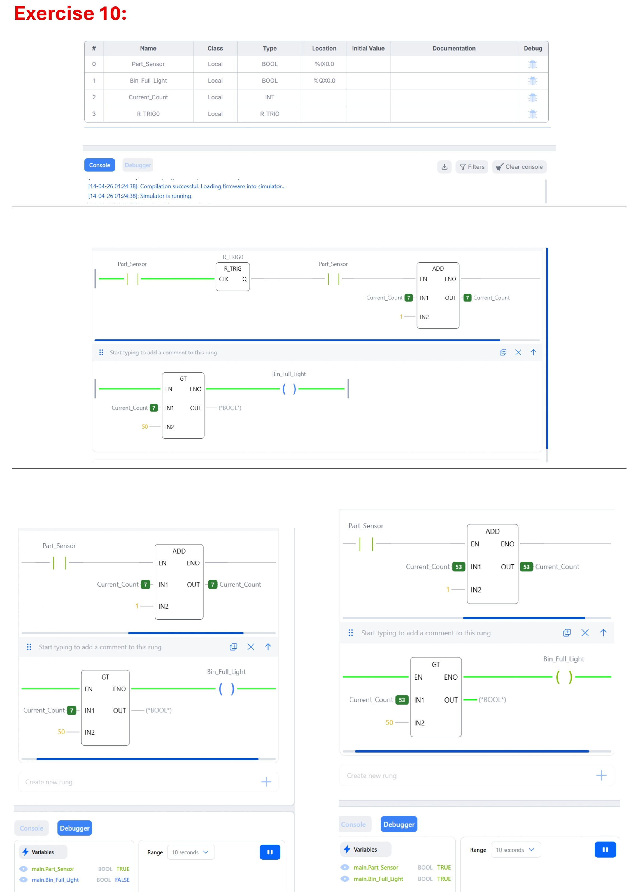

<div align="center">

# OpenPLC Ladder Logic Exercises

### Industrial Automation Exercises using **OpenPLC** and **IEC 61131-3 Ladder Logic**

A collection of practical OpenPLC Ladder Logic exercises developed with the OpenPLC Simulator. This repository demonstrates fundamental industrial automation concepts, including logic operations, timers, counters, latching circuits, edge detection, sequential motor control, and comparison instructions.

<br>

<p>
  
  
  
</p>

<p>
  
  
  
</p>

<br>

## Quick Navigation

📖 [Project Overview](#project-overview) •
📁 [Project Structure](#project-structure) •
📝 [Exercise List](#exercise-list) •
🖼️ [Exercise Gallery](#exercise-gallery) •
🛠️ [Skills Demonstrated](#skills-demonstrated) •
⚙️ [Technologies Used](#technologies-used)

</div>

---

## 📖 Project Overview

This repository contains a collection of **10 practical Ladder Logic exercises** developed using the **OpenPLC Editor** and based on the **IEC 61131-3** standard.

The exercises were designed to strengthen fundamental PLC programming skills commonly used in industrial automation. Each exercise focuses on a specific control concept and includes the corresponding OpenPLC project files together with a visual screenshot of the implemented ladder diagram.

The covered topics include:

- Basic logic operations (AND / OR)
- Latching (Seal-in) circuits
- TON (On-Delay) timers
- CTU (Count Up) counters
- Rising edge detection (R_TRIG)
- Master control and safety interlocks
- Dynamic timer preset manipulation
- Sequential motor startup
- Comparison instructions (GT)

### Project Objectives

- Develop practical PLC programming skills.
- Apply industrial automation concepts using Ladder Logic.
- Practice implementing IEC 61131-3 programming standards.
- Build a reusable collection of OpenPLC examples for learning and reference.

## 📂 Project Structure

The repository is organized into three main sections:

- **`images/`** — Screenshots of the completed Ladder Logic exercises.
- **`openplc/`** — OpenPLC project files for each exercise.
- **`README.md`** — Project documentation and exercise overview.

```text
openplc-ladder-logic-exercises/
│
├── README.md
├── LICENSE
│
├── images/
│   ├── exercise-01-and-logic.jpg
│   ├── exercise-02-or-logic.jpg
│   ├── exercise-03-latching-circuit.jpg
│   ├── exercise-04-ton-timer.jpg
│   ├── exercise-05-ctu-counter.jpg
│   ├── exercise-06-rising-edge-toggle.jpg
│   ├── exercise-07-master-control-switch.jpg
│   ├── exercise-08-dynamic-timer-presets.jpg
│   ├── exercise-09-sequential-motor-startup.jpg
│   └── exercise-10-comparison-logic.jpg
│
└── openplc/
    ├── exercise-01-and-logic/
    ├── exercise-02-or-logic/
    ├── exercise-03-latching-circuit/
    ├── exercise-04-ton-timer/
    ├── exercise-05-ctu-counter/
    ├── exercise-06-rising-edge-toggle/
    ├── exercise-07-master-control-switch/
    ├── exercise-08-dynamic-timer-presets/
    ├── exercise-09-sequential-motor-startup/
    └── exercise-10-comparison-logic/
```

## 📝 Exercise List

| # | Exercise | Industrial Concept | OpenPLC Project |
|:-:|-----------|-------------------|-----------------|
| 01 | AND Logic | Safety Interlock using series contacts | `exercise-01-and-logic` |
| 02 | OR Logic | Remote motor control using parallel branches | `exercise-02-or-logic` |
| 03 | Latching Circuit | Start/Stop seal-in control | `exercise-03-latching-circuit` |
| 04 | TON Timer | Delayed machine startup | `exercise-04-ton-timer` |
| 05 | CTU Counter | Conveyor box counting system | `exercise-05-ctu-counter` |
| 06 | Rising Edge Toggle | Toggle control using R_TRIG | `exercise-06-rising-edge-toggle` |
| 07 | Master Control Switch | Safety interlock with NC master stop | `exercise-07-master-control-switch` |
| 08 | Dynamic Timer Presets | Timer preset selection using MOVE | `exercise-08-dynamic-timer-presets` |
| 09 | Sequential Motor Startup | Time-delayed motor sequencing | `exercise-09-sequential-motor-startup` |
| 10 | Comparison Logic | Inventory monitoring using GT comparison | `exercise-10-comparison-logic` |


## 📷 Exercise Gallery

Each exercise includes its corresponding OpenPLC project and a screenshot of the implemented Ladder Logic.

| Exercise | Preview |
|----------|---------|
| **Exercise 01 – AND Logic (Safety Interlock)** |  |
| **Exercise 02 – OR Logic (Remote Control)** |  |
| **Exercise 03 – Latching Circuit** |  |
| **Exercise 04 – TON Timer** |  |
| **Exercise 05 – CTU Counter** |  |
| **Exercise 06 – Rising Edge Toggle** |  |
| **Exercise 07 – Master Control Switch** |  |
| **Exercise 08 – Dynamic Timer Presets** |  |
| **Exercise 09 – Sequential Motor Startup** |  |
| **Exercise 10 – Comparison Logic** |  |

---

# 🧠 Skills Demonstrated

Through these exercises, the following industrial automation and PLC programming skills are demonstrated:

- ✅ IEC 61131-3 Ladder Logic Programming
- ✅ OpenPLC Simulator Development
- ✅ Boolean Logic (AND / OR)
- ✅ Latching (Seal-in) Circuits
- ✅ TON (On-Delay) Timers
- ✅ CTU (Count Up) Counters
- ✅ Rising Edge Detection (R_TRIG)
- ✅ Toggle Circuit Design
- ✅ Master Control (Emergency Stop) Logic
- ✅ Dynamic Timer Presets using Variables
- ✅ Sequential Motor Control
- ✅ Comparison Instructions (Greater Than)
- ✅ Industrial Control Logic Design
- ✅ PLC Troubleshooting and Testing
- ✅ Automation System Documentation

---

# ⚙️ Technologies Used

| Category | Technology |
|----------|------------|
| PLC Simulator | OpenPLC Simulator |
| Programming Standard | IEC 61131-3 |
| PLC Language | Ladder Logic (LD) |
| Development Environment | OpenPLC Editor |
| Operating System | Windows |
| Documentation | Markdown |
| Version Control | Git & GitHub |

---

# 🚀 How to Run the Exercises

1. Install **OpenPLC Editor** or **OpenPLC Simulator**.
2. Clone this repository or download it as a ZIP file.
3. Open the desired exercise folder from:

   ```text
   openplc/
   ```

4. Load the project into OpenPLC.
5. Compile and run the Ladder Logic program.
6. Compare the implementation with the corresponding screenshot in the `images/` folder.

> **Note:** Each exercise is independent and can be executed separately without relying on other exercises.
